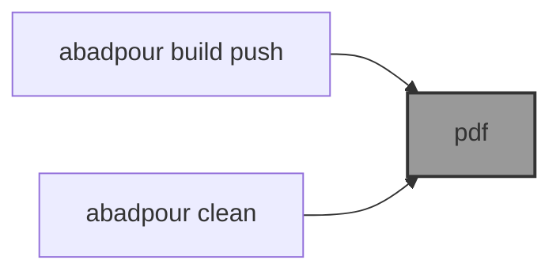

# 📜 abadpour

📜 `abadpour` is an [`@ai`](https://github.com/kamangir/bluer-ai) plugin for my CV/resume, in two versions: [compact](./pdf/arash-abadpour-resume.pdf) and [full](./pdf/arash-abadpour-resume-full.pdf).

```bash
pip install abadpour
```



---

[](https://pypi.org/project/abadpour/)
